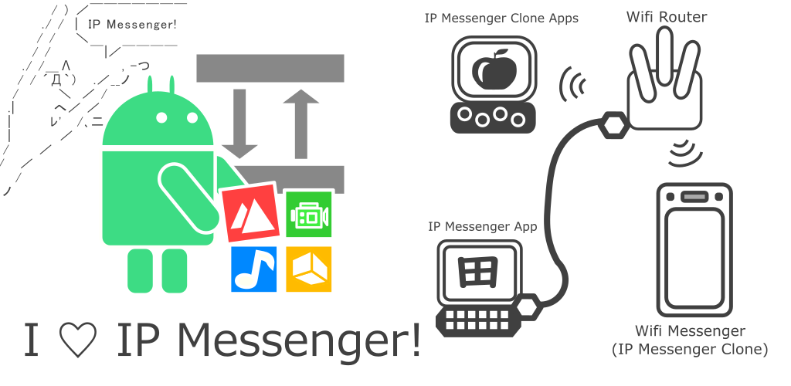

# Wifi Messenger

  
  
  

[Read the English README](README.md)

## 概要

Wifi Messengerは、IP Messengerプロトコルを使用したAndroidデバイス向けのメッセージングアプリケーションです。LAN内のデバイス間でメッセージやファイルをやり取りできます。

**注記**: このプロジェクトは、本家のIP Messengerプロジェクトとは一切関係がありません。

## 目的・機能

-   IP Messengerプロトコルをベースとした、LAN内でのメッセージ送受信機能を提供します。
-   テキストメッセージの送受信が可能です。
-   ファイルの送受信機能も備えています。
-   IP Messengerおよびクローンアプリと互換性があります。

## インストール

1. [`Wifi Messenger Ver1r10 github.apk`](Wifi%20Messenger%20Ver1r10%20github.apk)をダウンロードします。
2.  ダウンロードしたAPKファイルをAndroidデバイスにコピーします。
3.  Androidデバイス上でAPKファイルを開き、インストールを実行します。
    -   デバイスの設定で不明なアプリのインストールを許可する必要がある場合があります。

## 使い方

1.  アプリを起動し、同じLAN内の他のデバイスを検出します。
2.  送信したい相手を選択して、メッセージを送信します。

## ライセンス

-   このソフトウェアの利用は無償で自由です。
-   作者は、本ソフトウェアの使用によって生じた、いかなる損害、損失、不利益についても、一切の責任を負いません。作者は完全な免責となります。

## 連絡先

-   [あなたのウェブサイトURL]

## 免責事項

このソフトウェアは現状有姿で提供され、明示または黙示を問わず、いかなる保証も提供しません。

**特記事項**

*   本ソフトウェアの利用によって生じた、いかなる損害、損失、不利益についても、作者は一切の責任を負いません。
*   バージョンアップを定期的に行うことは考えていません。
*   アプリアイコンのAndroid ロボットは、Google が作成および提供している作品から複製または変更したものであり、クリエイティブ・コモンズ表示 3.0 ライセンスに記載された条件に従って使用しています。
