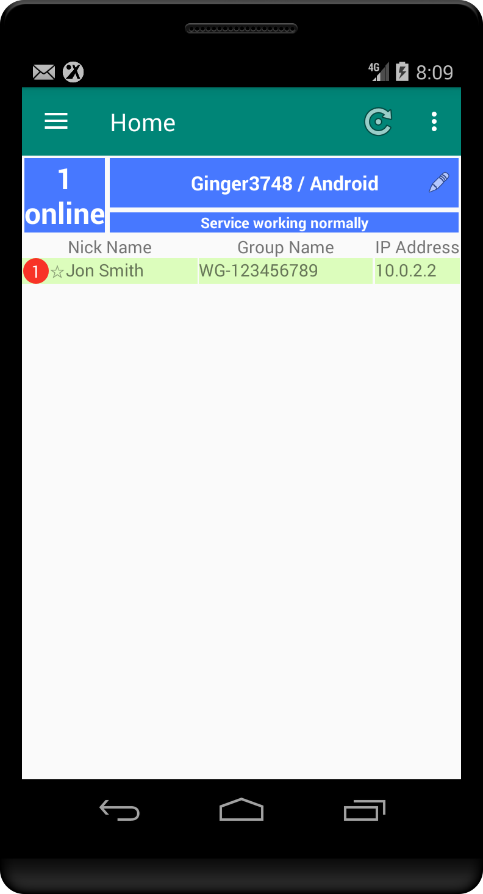
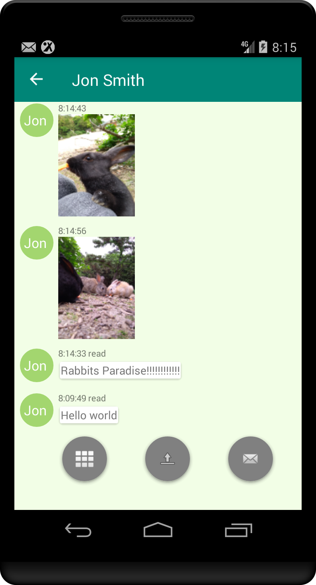
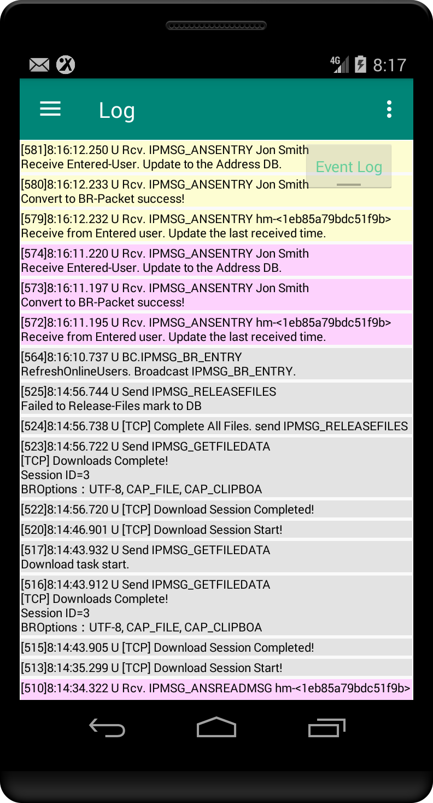

# Wifi Messenger

  
  
  

[日本語ReadMe](README.ja.md)

## Overview

Wifi Messenger is a messaging application for Android devices that uses the IP Messenger protocol. It allows you to exchange messages and files between devices on the same LAN.

**Note**: This project is not affiliated with the original IP Messenger project in any way.

## Purpose and Features

-   Provides message sending and receiving functionality on the LAN based on the IP Messenger protocol.
-   Text messages can be sent and received.
-   File sending and receiving functionality is also available.
-   Compatible with IP Messenger and its clone applications.

## Installation

1. Download the [`Wifi Messenger Ver1r10 github.apk`](Wifi%20Messenger%20Ver1r10%20github.apk).
2.  Copy the downloaded APK file to your Android device.
3.  Open the APK file on your Android device and perform the installation.
    -   You may need to allow the installation of apps from unknown sources in your device's settings.

## How to Use

1.  Launch the app and detect other devices on the same LAN.
2.  Select the recipient you want to send a message to and send your message.

## License

-   This software is free to use without any charge.
-   The author is not responsible for any damages, losses, or disadvantages caused by the use of this software. The author is completely exempt from liability.

## Contact

-   [https://okiislandsh.blogspot.com/]

## Disclaimer

This software is provided "as is" without any warranty, express or implied.

**Special Notes**

*   The author is not responsible for any damages, losses, or disadvantages caused by the use of this software.
*   Regular version updates are not planned.
*   The Android robot app icon is reproduced or modified from work created and shared by Google and used according to terms described in the Creative Commons 3.0 Attribution License.
